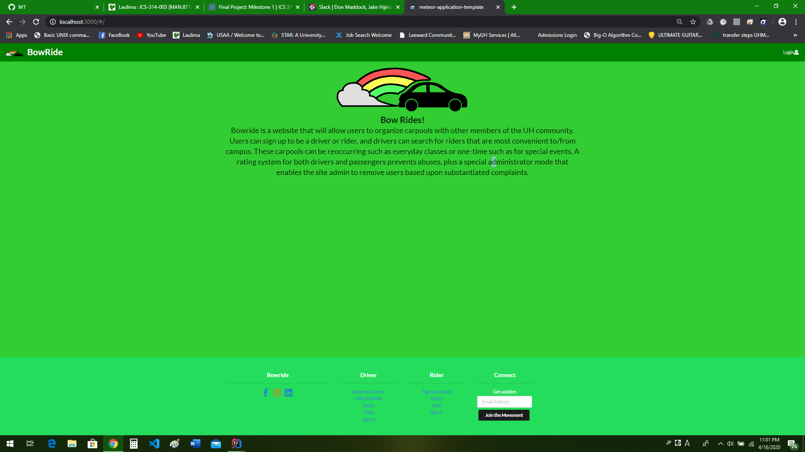
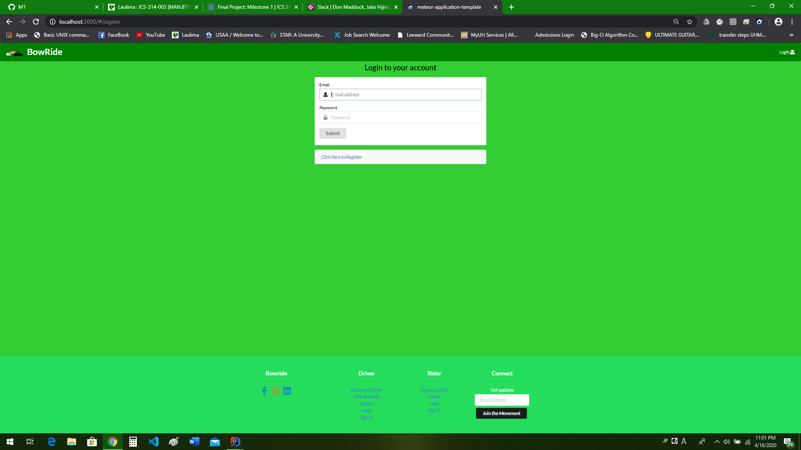
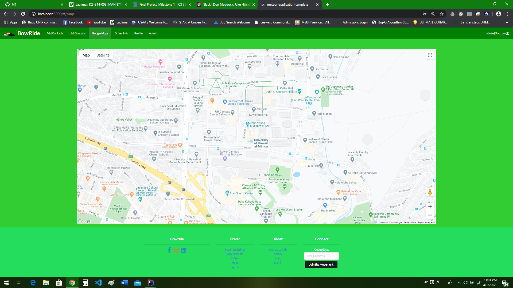
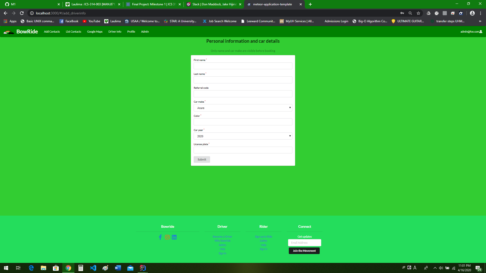

#### Bowride is a website that will allow users to organize carpools with other members of the UH community. Users can sign up to be a driver or rider, and drivers can search for riders that are most convenient to/from campus. These carpools can be reoccurring such as everyday classes or one-time such as for special events. A rating system for both drivers and passengers prevents abuses, plus a special administrator mode that enables the site admin to remove users based upon substantiated complaints.

## RUN APP HERE!
[BowRide APP](http://bowride.meteorapp.com/#/)

## Our Members
Our Github [Organization](https://github.com/bowride) 

* [Derek Sola](https://derekasola.github.io/)

* [Don Maddock](https://don-maddock.github.io/)

* [Jake Hiji](https://jakehiji.github.io/)

* [Moseli Motsoehli](https://deepsmoseli.github.io/)

## Milestone 1
A link to our [first Milestone project board.](https://github.com/bowride/bowride/projects/1)

## Milestone 2
A link to our [second Milestone project board.](https://github.com/bowride/bowride/projects/2)

## Users Guide

## Developer Guide
First, [install Meteor](https://www.meteor.com/install).

Second, go to [https://github.com/bowride/bowride](https://github.com/bowride/bowride), and click the "Use this template" button. Complete the dialog box to create a new repository that you own that is initialized with this template's files.

Third, go to your newly created repository, and click the "Clone or download" button to download your new GitHub repo to your local file system.  Using [GitHub Desktop](https://desktop.github.com/) is a great choice if you use MacOS or Windows.

Fourth, cd into the app/ directory of your local copy of the repo, and install third party libraries with:

```
$ meteor npm install
```

Last, get a Google Maps API key by following the guide at [https://developers.google.com/maps/documentation/javascript/get-api-key](https://developers.google.com/maps/documentation/javascript/get-api-key) and place it in the [GoogleMaps.jsx file](https://github.com/bowride/bowride/blob/master/app/imports/ui/pages/GoogleMaps.jsx) where it says API_KEY_HERE.

```jsx
export default class SimpleMap extends Component{

  render() {
    return (

        <div className='ui center aligned container' style={{height: '80vh', width: '80vw'}}>
        <GoogleMapReact
            bootstrapURLKeys={{ key: 'API_KEY_HERE'}}
            defaultCenter={{lat: 21.298872, lng: -157.817204}}
            defaultZoom={ 16 }
        >
          <Marker
              lat={21.298872}
              lng={-157.817204}
              text={'Pick-Up Location'}
          />
        </GoogleMapReact>
        </div>
    );
  }

}
```

## Running the system

Once the libraries are installed, you can run the application by invoking the "start" script in the [package.json file](https://github.com/bowride/bowride/blob/master/app/package.json):

```
$ meteor npm run start
```

## Landing Page Mockup


## Home Page Mockup


## current Landing page


## Log in page


## Google maps page


react-google-maps requires  meteor npm install --save react-google-maps to run.

## Driver sign up
