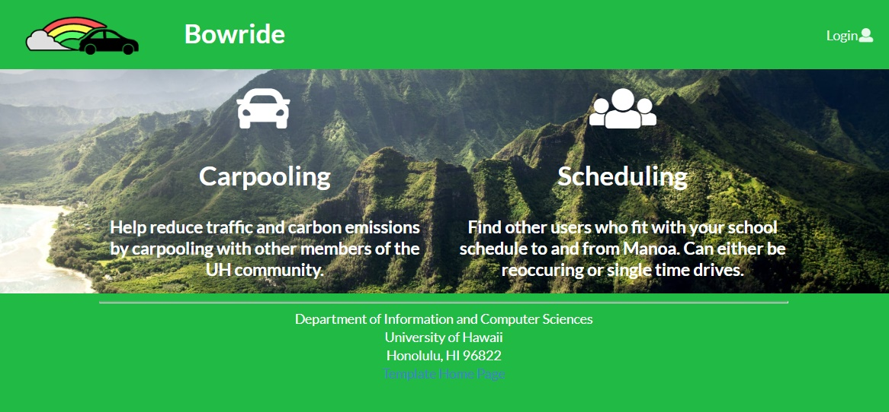
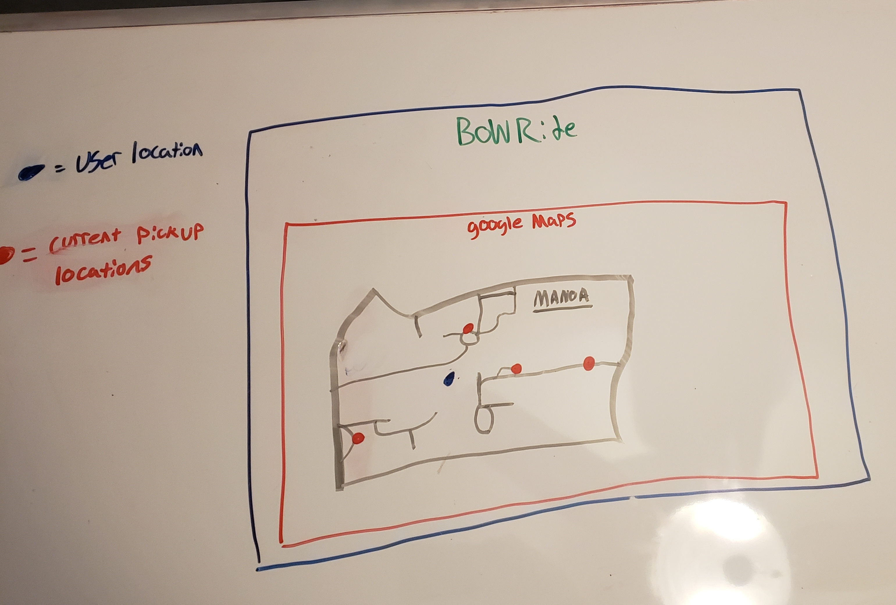

#### Bowride is a website that will allow users to organize carpools with other memebers of the UH community. Users can sign up to be a driver or rider, and drivers can search for riders that are most convenient to/from campus. These carpools can be reoccurring such as everyday classes or one-time such as for special events. A rating system for both drivers and passengers prevents abuses, plus a special administrator mode that enables the site admin to remove users based upon substantiated complaints.

## Our Members

* [Derek Sola](https://github.com/derekasola)

* [Don Maddock](https://github.com/Don-Maddock)

* [Jake Hiji](https://github.com/JakeHiji)

* [Moseli Motsoehli](https://github.com/DeepsMoseli)

Our Github Organization: https://github.com/bowride

## Milestone 1
A link to our [first Milestone project board.](https://github.com/bowride/bowride/projects/1)

# Current Progress

## Landing Page Mockup

## Home Page Mockup

